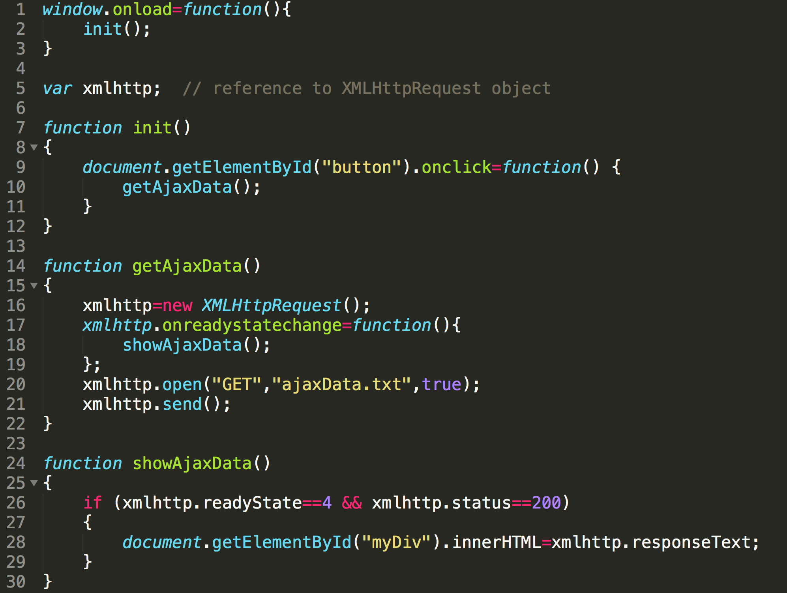
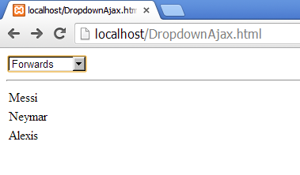
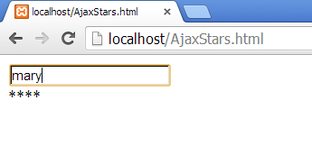

# Ajax Exercise 1 – Hello Ajax
		
> Note:: Complete ALL the exercises in this section.  If you need help email thomas.devine@lyit.ie


1.	Use the code in the listings below to demonstrate Ajax in action. Save these files in the ``htdocs`` folder of a XAMPP.

	``--HelloAjax.html--``

	```html
	<!doctype html>
	<html>
	<head>
	<script src="HelloAjax.js"></script>
	</head>
	<body>
	<div id="myDiv">
	Click button to get Ajax to change this text
	</div>
	<button id="button" type="button">Get Data</button>
	</body>
	</html>

	```


	``--HelloAjax.js--``

	


	``--ajaxData.txt--``

	```html
	<b>hello, world!</b>

	```

1.	The Figure below shows a HTML page ``DropdownAjax.html`` with a dropdown box that has options:

	```
	Choose type...
	Goalkeepers
	Defenders
	Midfielders
	Forwards

	```

	

	Write the code in a JavaScript program ``DropdownAjax.js`` that retrieves the appropriate data for the player type selected from either of the corresponding files – ``goalkeepers.txt``, ``defenders.txt``, ``midfielders.txt`` and ``forwards.txt`` - and displays that data on the HTML page.

	Ask for a demonstration of this functionality. The players are:

	```
	-Goalkeepers -
	Ter Stegen
	Bravo

	-Defenders -
	Pique
	Bartra
	Alves
	Alba

	-Midfielders -
	Xavi
	Iniesta
	Rakitic
	Busquets

	-Forwards -
	Messi
	Neymar
	Suarez
	
	```

1.	Use the code in the listings below to demonstrate Ajax in action with PHP. Save these files in the ``htdocs`` folder of a XAMPP.

	``--HelloAjaxAndPHP.html--``

	```html
	<!doctype html>
	<html>
	<head>
	<script type="text/javascript" src="HelloAjaxAndPHP.js"></script>
	</head>

	<body>
	<div id="myDiv"></div>
	<button id="button" type="button">Get Ajax PHP Data</button>
	</body>
	</html>

	```

	``--HelloAjaxAndPHP.js--``

	```javascript
	window.onload=function(){
	  init();
	}

	var xmlhttp;  // reference to XMLHttpRequest object

	function init()
	{
	  document.getElementById("button").onclick=function() {
	    getAjaxData();
	  }

	}
	function getAjaxData()
	{
	  xmlhttp=new XMLHttpRequest();
	  xmlhttp.onreadystatechange=showAjaxData;
	  xmlhttp.open("GET","HelloAjaxAndPHP.php",true);
	  xmlhttp.send();
	}


	function showAjaxData()
	{
	  if (xmlhttp.readyState==4 && xmlhttp.status==200)
	  {
	    document.getElementById("myDiv").innerHTML=xmlhttp.responseText;
	  }
	}

	```

	``--HelloAjaxAndPHP.php--``

	```php	
	<?php
	  print("<b>Ajax PHP hello, world!</b>");
	?>

	```


1.	The Figure below shows a HTML page ``AjaxStars.html`` with a text box. Write the code in a JavaScript program ``AjaxStars.js`` that retrieves the appropriate number of stars from an Ajax PHP program ``AjaxStars.php`` and prints them beneath the text box. As the text is being typed the appropriate number of stars should appear.

	

	Ask for a demonstration of this functionality.

