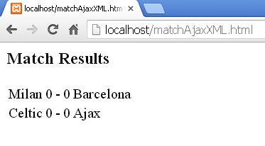

# Ajax Exercise 2 – Ajax JSON
		
> Complete ALL the exercises in this section.

1.	Use the 3 listings below to demonstrate Ajax in action with JSON data.

	``--clubs.json--``

	```javascript
	{
	"clubs": [
	        { "name":"Chelsea" , "ground":"Stamford Bridge" },
	        { "name":"Liverpool" , "ground":"Anfield" },
	        { "name":"Manchester Utd" , "ground":"Old Trafford" },
	        { "name":"Arsenal" , "ground":"Emirates Stadium" }
	]
	}

	```


	``--clubsAjaxJSON.html--``

	```html
	<html>
	<head>
	  <script src="clubsAjaxJSON.js"></script>
	</head>

	<body>
	<h1>Clubs</h1>
	<div id="myDiv"></div>
	</body>
	</html>

	```


	``--clubsAjaxJSON.js--``

	```javascript
	var xmlhttp;

	window.onload=function(){
	  getAjaxData();
	}

	function getAjaxData()
	{
	  if (window.XMLHttpRequest)
	    xmlhttp=new XMLHttpRequest();
	  else
	    xmlhttp=new ActiveXObject("Microsoft.XMLHTTP");

	  xmlhttp.onreadystatechange = showJSONData;
	  xmlhttp.open("GET", "clubs.json", true);
	  xmlhttp.send();
	}

	function showJSONData()
	{
	  if (xmlhttp.readyState==4 && xmlhttp.status==200)
	  {
	    var data = JSON.parse(xmlhttp.responseText);
	    var output = '<ul>';
	    for (var i = 0; i < data.clubs.length; i++) {
	        output += '<li>' + data.clubs[i].name + '</li>';
	    }
	    output += '</ul>';
	    document.getElementById("myDiv").innerHTML = output;
	  }
	}

	```

1.	Modify the code in ``clubsAjaxJSON.js`` so each club's ground is shown in brackets after the club name, i.e.

	```
	Chelsea (Stamford Bridge)
	Liverpool (Anfield)
	Manchester Utd (Old Trafford)
	Arsenal (Emirates Stadium)

	```

1.	Write the code for a Match Results HTML page called ``matchAjaxJSON.html`` as shown below. It will display the data contained in the JSON file ``matches.json`` given below.

	

	``--matches.json--``

	```javascript
	{
	"results": [
	        {"hTeam":"Milan","hTeamScore":"0","aTeamScore":"0","aTeam":"Barcelona"},
	        {"hTeam":"Celtic","hTeamScore":"0","aTeamScore":"0","aTeam":"Ajax"}
	]
	}

	```	

	Name the JavaScript file ``matchAjaxJSON.js`` and use a HTML table to display the content.

1.	Modify the code in Match Results so that the scores are retrieved from the JSON file every 5 seconds. If a change is made to the scores in the JSON file it should be automatically updated in the HTML page.

1.	Run the code in [SQL2JSON.zip](https://github.com/barcaxi/wap2017/blob/master/files/SQL2JSON.zip?raw=true) that demonstrates how JSON content can be generated from a SQL query. This is extremely useful.

	You’ll need to use the *music* database.


1.	Modify the code in the Match Results solution so that the scores are retrieved from a database where the teams and results are stored. You will have to create a database called ``matchDB`` with a table called ``matches`` with fields for ``hTeam``, ``hTeamScore``, ``aTeam`` and ``aTeamScore``.

	Furthermore, if a change is made to the scores in the database it should by automatically updated in the HTML page. Check every 5 seconds for updated scores.	