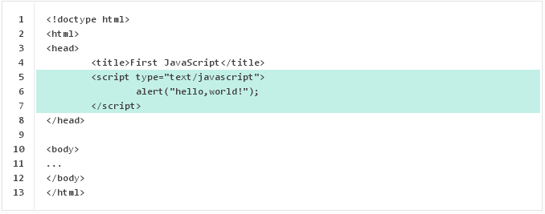
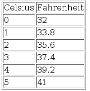
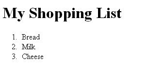

JavaScript Exercise 1 -- Fundamentals
-------------------------------------
		
> Note:: Complete ALL the exercises in this section.


1.	Create a HTML page called ``FirstJS.html`` that has this code:	
	
	
		
	View the HTML file to see the effect of the JavaScript code.


1.	Always keep the JavaScript separate from the HTML.

	Create the files ``SecondJS.html`` and ``example.js`` as shown here:
	
	``SecondJS.html``
	```html
	<!DOCTYPE html>
	<html>
	<head>
		<title>Second JavaScript</title>
		<script type="text/javascript" src="example.js"></script>
	</head>

	<body>
	Now you see me...
	</body>
	</html>
	
	```

	``example.js``
	```java
	alert("hello from example.js");
	
	```
		
	Save and view.

	

1.	Using the code in ``cTofTable.html`` here:

	```java
	<!doctype html>
	<html>
	<head>
		<title>Celsius to Fahrenheit</title>
		<script type="text/javascript" src="htmlFunctions.js"></script>
		<script language="javascript">
			// get min and max values right away
			var min,max
			min = prompt("Please enter the MINIMUM celsius value:", "")
			max = prompt("Please enter the MAXIMUM celsius value:", "")
		</script>

		<!-- ----------------------------- -->
		<style>
			.odd
			{
				background: #58beea;
			}
		</style>
		<!-- ----------------------------- -->

	</head>

	<body>

	<!-- ----------------------------- -->
	<h1>Cel to Fahr</h1>
	<div></div>
	<!-- ----------------------------- -->

	<script language="javascript">
	  createTable(min,max);
	</script>
	</body>
	</html>
		
	```		

	write the missing JavaScript file ``htmlFunctions.js`` that implements the ``createTable()`` function to produce the output shown below where min=0 and max=5. 	

	

	Also move any JavaScript code within the ``<head>`` tag into ``htmlFunctions.js``


1.	The code below shows a function ``createMyList()`` being called in a Javascript file ``MyList.html``. 
	You must write the code for this file and the function ``createMyList()`` that does the following:

	-	ask the user to input the no. of items on the list (use a Input prompt box);
	-	then ask for the name of each item to be input;
	-	print a HTML list of the items entered.

	```java
	<html>
	<head>
		<title>My Shopping List</title>
		<script type="text/javascript" src="MyList.js">
		</script>
	</head>

	<body>
	<h1>My Shopping List</h1>
	<script type="text/javascript">
		createMyList();
	</script>
	</body>
	</html>

	```		
	
	As an example, the user may have input 3 items -- bread, milk and cheese.  The picture below shows 
	the output. Ask your lecturer for a demostration of this in action.

	

