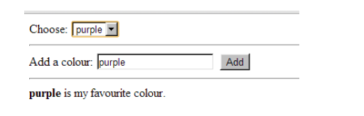
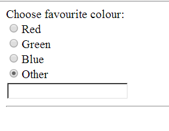
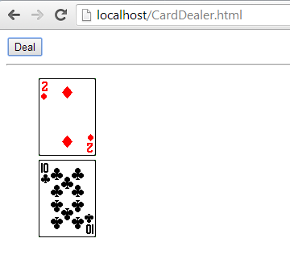

# JavaScript Exercise 5 - DOM Manipulation
		
> Note:: Complete ALL the exercises in this section.


1.	Use [this](http://jsfiddle.net/barcaxi/gjweq52y/3/) fiddle to create ``artist.html`` and ``artist.js`` files.
	When the JavaScript code is executed a new list item for Nelly Furtado is added.
	Test everything works.
	

1.	Add a button with the caption "Add Nelly" that adds a new list item for "Nelly Furtado" each time it is clicked.

	
1.	In the previous exercise the button can add the text "Nelly Furtado" more than once to the list. 
	Modify the code so "Nelly Furtado" can only be added once.
	

1.	Update the ``favouriteV2.html`` page so that the user can add a new colour to the drop down box using 
	a text box. 
	
	

	Test everything works.	

	
1.	Create a web page that initially shows just four radio buttons as shown below.
	If the *Other* radio button is clicked a text box should then appear.
	
	

	Try to ensure only one text box appears when clicking the Other radio button more than once.

	You must keep the HTML and JavaScript in separate files please.
	

1.	Create a web page ``cardDealer.html`` that allows the user to deal cards randomly from a pack 
	of cards as shown here:
		
	
	

	You can download the images from [here](https://github.com/barcaxi/wap2017/blob/master/files/cards.zip?raw=true).

	Ensure a maximum of 5 cards can be dealt and never deal the same card more than once.

	Use this code to generate a random number::
	```	
		var num=Math.floor(Math.random()*52)+1;

	```

