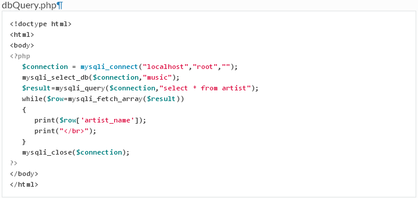

# PHP Database Ex 1 -- Database Programs

> Complete ALL the exercises in this section.  If you need a solution just ask.

1.	Setup the ``music`` database on your XAMPP MySQL server.  See [here](https://raw.githubusercontent.com/barcaxi/CSAD2017/master/files/music.sql)

1.	Write and execute the PHP program ``dbQuery.php`` that demonstrates how to retrieve data from a database.		

	
	

1.	Which PHP function connects to the database server?

	- ``mysqli_select_db()``
	- ``mysql_connect_db()``
	- ``mysqli_connect()``
	
	
1.	Which PHP function selects a database from the server?

	- ``mysqli_select()``
	- ``mysql_select_db()``
	- ``mysqli_select_db()``

## Part 1 - MusicDB

1.	Write a PHP program ``listArtists.php`` that prints the artist names in an unordered list i.e. ``<ul>``.

1.	Write a PHP script called ``artistsTable.php`` that displays ALL the artist numbers and names inside a HTML table.

## Part 2 - FootballDB

1.	Create a database, table and some records:

	(a)	Create a database called ``footballDB``

	(b)	Create a table called ``clubs`` with two fields - ``name`` and ``ground``

	(c)	Insert at least 5 records into the new table
	

1.	Write a PHP program ``listClubs.php`` that prints the club names in an unordered list.

1.	Write a PHP script called ``clubTable.php`` that displays ALL the clubs table data inside a HTML table.

1.	Write a PHP script called ``clubDropdown.php`` that displays the club names inside a dropdown box.
